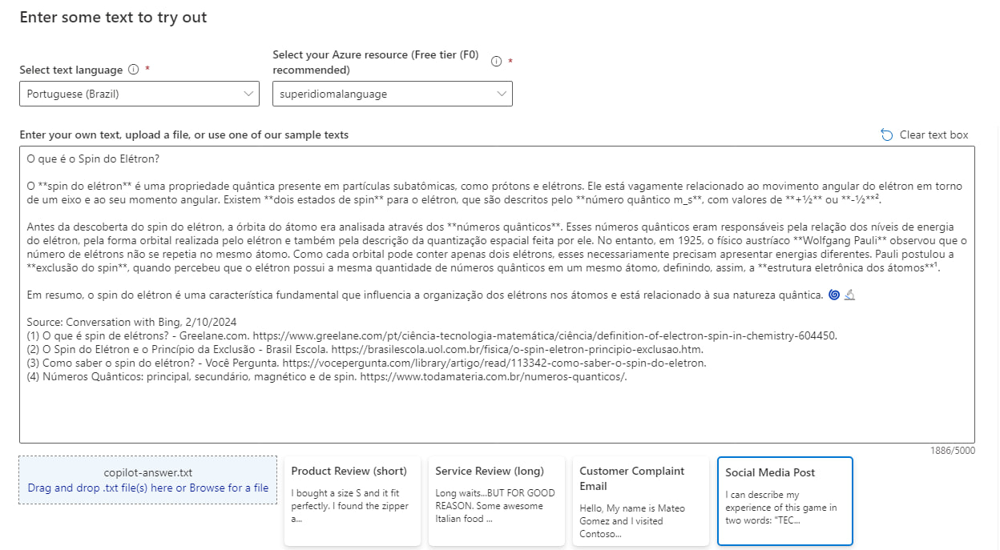
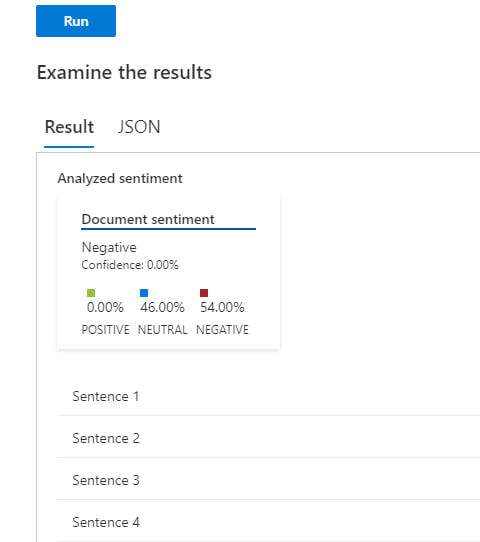
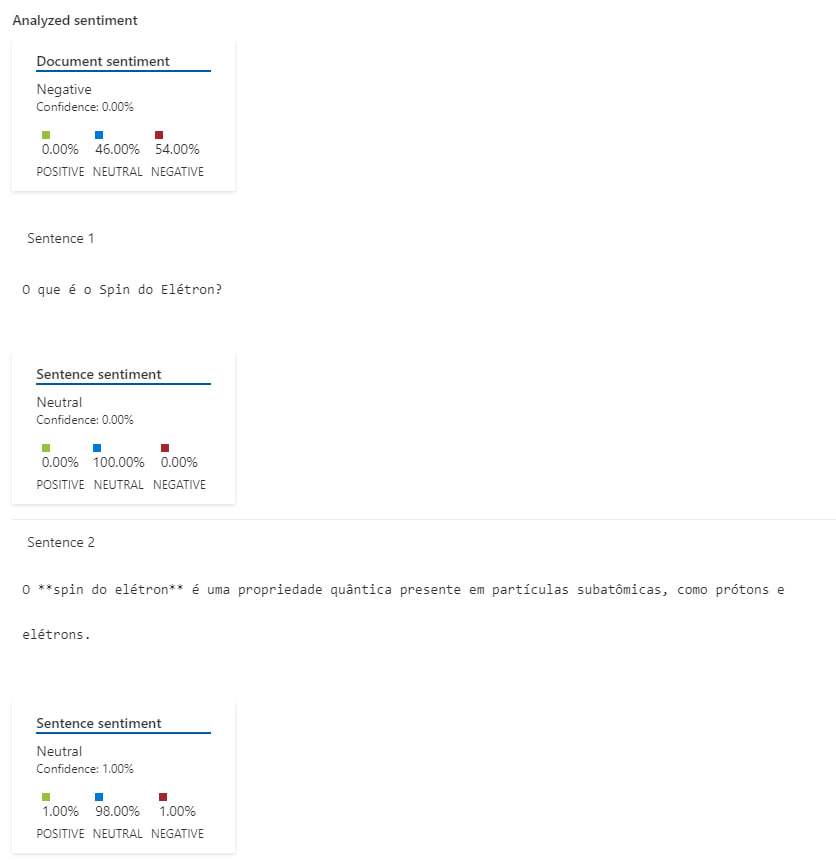
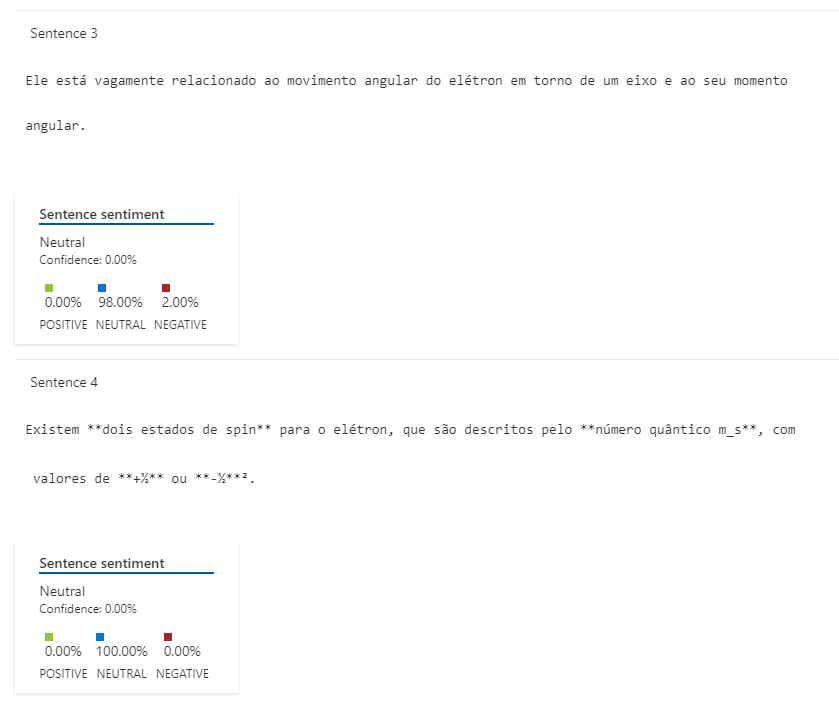
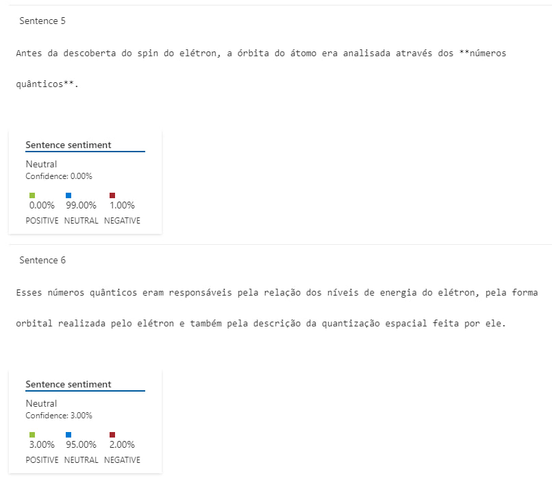

# Web Dio Azure Language Studio

Projeto demonstrando o uso do Language Studio no reconhecimento de opiniões e sentimentos e monstrando os resultados na forma de porcentagem. A pasta inputs contém um arquivo de texto sobre um tema da física quântica que foi usado como exemplo de uso do serviço.

## 1 - O texto foi gerado a partir do copilot respondendo à uma pergunta sobre física quântica, depois de definir a língua em que o texto está escrito, é só clicar em run.

## 2 - Resultado da análise de sentimento gerado pelo Language Studio.

## 1 - O legal é que ele divide o texto em sentenças, mostra o resultado do sentimento de cada sentença separadamente e a porcentagem de confiança que ele tem para cada uma delas.

